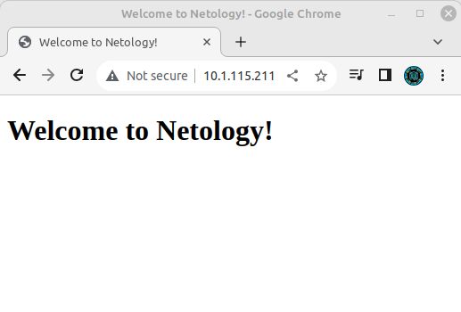

# Ответы по домашнему заданию к занятию «Конфигурация приложений»

### Задание 1. Создать Deployment приложения и решить возникшую проблему с помощью ConfigMap. Добавить веб-страницу

1. Создать Deployment приложения, состоящего из контейнеров busybox и multitool.

Ответ: Создан деплоймент [deployment-01](deployment-01.yaml):
```
apiVersion: apps/v1
kind: Deployment
metadata:
  name: deployment-01
  labels:
    app: nginx
spec:
  replicas: 1
  selector:
    matchLabels:
      app: nginx_multitool
  template:
    metadata:
      labels:
        app: nginx_multitool
    spec:
      containers:
      - name: multitool
        image: wbitt/network-multitool
        envFrom:
          - configMapRef:
              name: mt-configmap
        ports:
        - containerPort: 1180
          name: mt-http
        - containerPort: 11443
          name: mt-https
      - name: nginx
        image: nginx:1.20
        ports:
        - containerPort: 80
        volumeMounts:
        - mountPath: /usr/share/nginx/html/index.html
          subPath: index.html
          name: nginx-conf
      volumes:
      - name: nginx-conf
        configMap:
          name: nginx-configmap
```

2. Решить возникшую проблему с помощью ConfigMap.

Ответ. Проблема решена с помощью изменения портов, на которых стартует ***nginx*** в контейнере ***multitool***.
Порты описаны в configMap [mt-configmap](deployment-01.yaml):
```
apiVersion: v1
kind: ConfigMap
metadata:
  name: mt-configmap
data:
  HTTP_PORT: "1180"
  HTTPS_PORT: "11443"
```
3. Продемонстрировать, что pod стартовал и оба конейнера работают.

Ответ: Вывод команды:
```
fedor@fedor-X99-F8:~/CODE/Netology/DevOps/kuber-homeworks/2.3$ kubectl get pods -o wide
NAME                                  READY   STATUS    RESTARTS   AGE     IP             NODE           NOMINATED NODE   READINESS GATES
nfs-server-nfs-server-provisioner-0   1/1     Running   0          11h     10.1.115.206   fedor-x99-f8   <none>           <none>
deployment-01-7586876d-sscbn          2/2     Running   0          2m19s   10.1.115.211   fedor-x99-f8   <none>           <none>
```
4. Сделать простую веб-страницу и подключить её к Nginx с помощью ConfigMap. Подключить Service и показать вывод curl или в браузере.

Ответ: Страница размещена в configMap [nginx-configmap](deployment-01.yaml):
```
apiVersion: v1
kind: ConfigMap
metadata:
  name: nginx-configmap
data:
  index.html:
     <!DOCTYPE html>
     <html>
     <head>
     <title>Welcome to Netology!</title>
     <body>
     <h1>Welcome to Netology!</h1>
     </html>
```
5. Предоставить манифесты, а также скриншоты или вывод необходимых команд.

Ответ:
- манифесты: [deployment-01.yaml](deployment-01.yaml);
- выводы команд выше по тексту.
- скриншот загруженной страницы в браузере:


------

### Задание 2. Создать приложение с вашей веб-страницей, доступной по HTTPS 

1. Создать Deployment приложения, состоящего из Nginx.
2. Создать собственную веб-страницу и подключить её как ConfigMap к приложению.
3. Выпустить самоподписной сертификат SSL. Создать Secret для использования сертификата.
4. Создать Ingress и необходимый Service, подключить к нему SSL в вид. Продемонстировать доступ к приложению по HTTPS. 
4. Предоставить манифесты, а также скриншоты или вывод необходимых команд.
